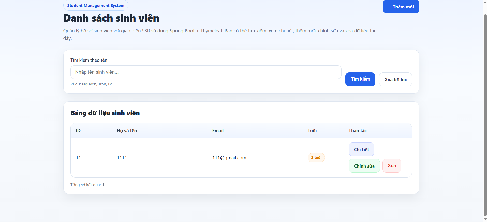
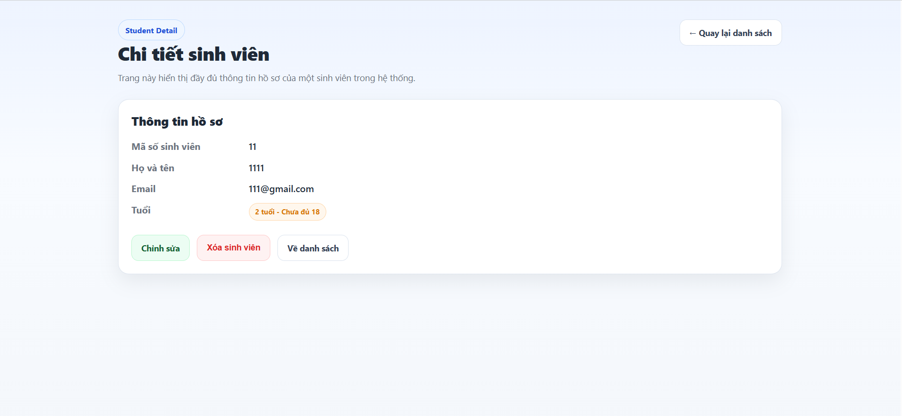
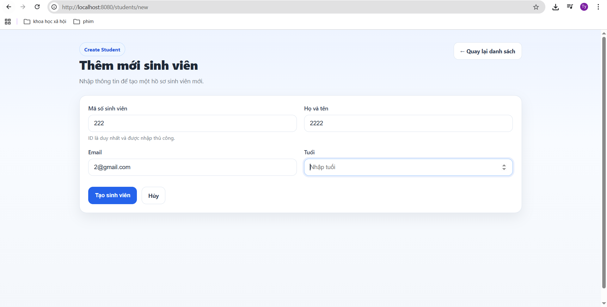
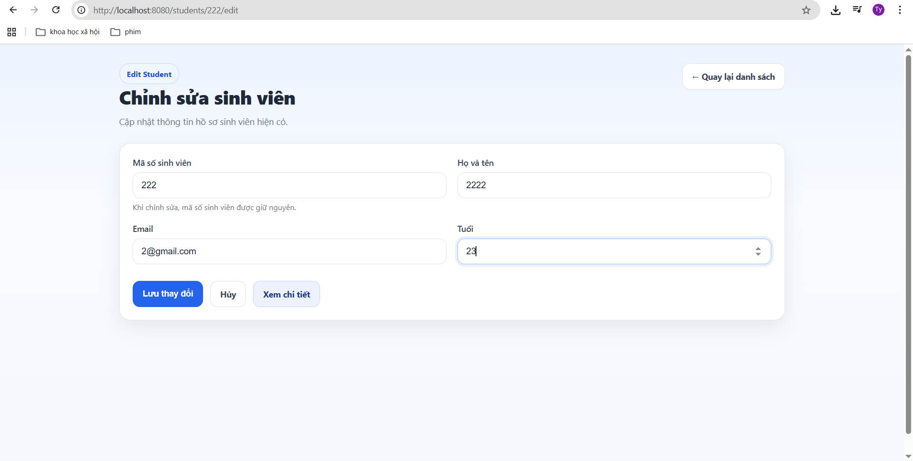
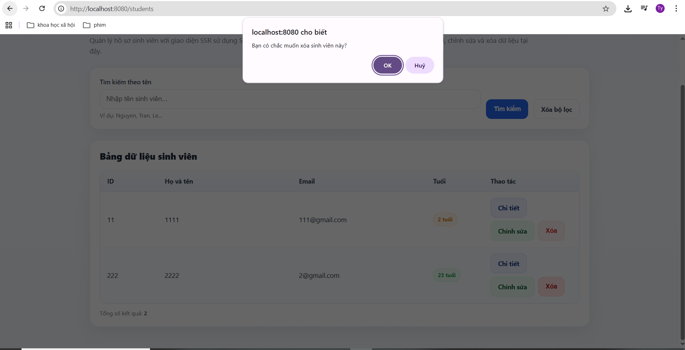
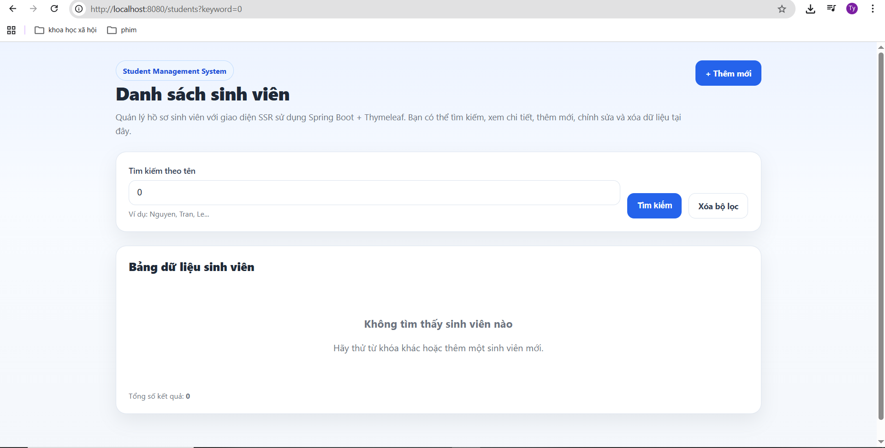

# Student Management System

A basic web application for managing student profiles, built with **Spring Boot**, **Thymeleaf**, **Spring Data JPA**, and **PostgreSQL**.

---

## 1. Team Information

**Course:** Advanced Software Engineering  
**University:** Ho Chi Minh City University of Technology  
**Faculty:** Faculty of Computer Science and Engineering

### Group Members
- **Student 1:** [Full Name] - [Student ID]

## 2. Public URL

- **Web Service URL:** [Insert deployed Render URL here]
- **Example:** `https://student-ws6q.onrender.com`

> Replace this with the actual public URL after completing Lab 5 deployment.

---


## 3. Project Overview

This project implements a **Student Management System** that supports:

- Managing student information:
  - ID
  - Name
  - Email
  - Age
- REST API for data access
- Server-Side Rendered (SSR) web interface using Thymeleaf
- Persistent storage with PostgreSQL
- Dockerized deployment
- Cloud deployment using Render and Neon

---

## 4. Technologies Used

- **Java 17**
- **Spring Boot**
- **Spring Web**
- **Spring Data JPA**
- **Thymeleaf**
- **Bean Validation**
- **PostgreSQL**
- **Maven Wrapper**
- **Docker**
- **Render**
- **Neon**

---

## 5. Project Structure


src/main/java/vn/edu/hcmut/cse/adse/lab/
├── StudentManagementApplication.java
├── controller/
├── dto/
├── entity/
├── exception/
├── repository/
└── service/

src/main/resources/
├── application.properties
├── static/
│   ├── css/
│   └── js/
└── templates/
    ├── students.html
    ├── student-detail.html
    └── student-form.html


## 6. Features

### 6.1 Backend REST API

* `GET /api/students` — Get all students
* `GET /api/students/{id}` — Get student by ID
* `POST /api/students` — Create a new student
* `PUT /api/students/{id}` — Update student information
* `DELETE /api/students/{id}` — Delete a student

### 6.2 Web Interface (SSR)

* `GET /students` — Student list page
* Search students by name
* View student details
* Add new student
* Edit existing student
* Delete student with confirmation

---

## 7. How to Run the Project

### 7.1 Prerequisites

Make sure you have installed:

* **JDK 17+**
* **Docker** (optional, for containerized run)
* **PostgreSQL**
* Internet connection for downloading Maven dependencies

---

### 7.2 Clone the Repository

```bash
cd student-management
```

---

### 7.3 Configure Environment Variables

Create a `.env` file in the project root:

```env
POSTGRES_HOST=localhost
POSTGRES_PORT=5432
POSTGRES_DB=student_management
POSTGRES_USER=postgres
POSTGRES_PASSWORD=your_password_here

SPRING_DATASOURCE_URL=jdbc:postgresql://${POSTGRES_HOST}:${POSTGRES_PORT}/${POSTGRES_DB}
SPRING_DATASOURCE_USERNAME=${POSTGRES_USER}
SPRING_DATASOURCE_PASSWORD=${POSTGRES_PASSWORD}
```


---

### 7.4 Configure `application.properties`

Example:

```properties
spring.application.name=student-management
server.port=${PORT:8080}

spring.datasource.url=${SPRING_DATASOURCE_URL}
spring.datasource.username=${SPRING_DATASOURCE_USERNAME}
spring.datasource.password=${SPRING_DATASOURCE_PASSWORD}
spring.datasource.driver-class-name=org.postgresql.Driver

spring.jpa.hibernate.ddl-auto=update
spring.jpa.show-sql=true
spring.jpa.properties.hibernate.dialect=org.hibernate.dialect.PostgreSQLDialect
```

---

### 7.5 Run with Maven Wrapper

On Linux/macOS:

```bash
./mvnw spring-boot:run
```

On Windows:

```bash
mvnw.cmd spring-boot:run
```

The application will start at:

```text
http://localhost:8080
```

---

### 7.6 Build the Project

```bash
./mvnw clean package
```

Generated `.jar` file will be in:

```text
target/
```

---

## 8. Docker Instructions

### 8.1 Build Docker Image

```bash
docker build -t student-management .
```

### 8.2 Run Docker Container

```bash
docker run -p 8080:8080 \
  -e SPRING_DATASOURCE_URL=jdbc:postgresql://<host>:5432/<db> \
  -e SPRING_DATASOURCE_USERNAME=<username> \
  -e SPRING_DATASOURCE_PASSWORD=<password> \
  student-management
```

---

## 9. Deployment

### 9.1 Database Deployment

* **Platform:** Neon
* **Database URL:** [Insert Neon database URL or description here]

### 9.2 Application Deployment

* **Platform:** Render
* **Runtime:** Docker
* **Public URL:** [Insert deployed Render URL here]

### 9.3 Environment Variables on Render

Set the following variables on Render:

* `DATABASE_URL`
* `DB_USERNAME`
* `DB_PASSWORD`

If your application uses:

```properties
spring.datasource.url=${DATABASE_URL}
spring.datasource.username=${DB_USERNAME}
spring.datasource.password=${DB_PASSWORD}
```

then make sure Render values match your Neon database credentials.

---

## 10. API Testing

### Get all students

```http
GET /api/students
```

### Get student by ID

```http
GET /api/students/{id}
```

### Create student

```http
POST /api/students
Content-Type: application/json
```

Example request body:

```json
{
  "id": "S001",
  "name": "Nguyen Van A",
  "email": "vana@example.com",
  "age": 20
}
```

### Update student

```http
PUT /api/students/{id}
Content-Type: application/json
```

### Delete student

```http
DELETE /api/students/{id}
```

---

## 11. Answers to Theory Questions

### Lab 1

#### Question 1: Why does the database reject inserting a duplicate primary key?

Because the `id` column is defined as a **Primary Key**, and primary keys must be unique.
If two rows have the same ID, the database cannot distinguish them properly, so it raises a `UNIQUE constraint failed` error.

#### Question 2: What happens if `name` is NULL?

If the database schema does not explicitly define `name` as `NOT NULL`, the insert may succeed.
However, this can cause problems in the Java application because the business logic may expect every student to have a valid name. It reduces data integrity and may lead to unexpected behavior in the UI or API.

#### Question 3: Why is old data lost when restarting the application in Lab 1?

Because the configuration uses:

```properties
spring.jpa.hibernate.ddl-auto=create
```

This tells Hibernate to **drop the old schema and recreate it** every time the application starts.
As a result, existing data is deleted on each restart.

---

### Lab 2

#### Why build REST API before building the frontend?

Building the backend first helps:

1. Test business logic independently of the UI
2. Reuse the same API for different clients (web, mobile, third-party systems)
3. Make the system easier to maintain and extend

#### What is the role of each layer?

* **Controller:** receives HTTP requests and returns responses
* **Service:** contains business logic
* **Repository:** handles database access
* **Entity:** maps Java objects to database tables

#### What is Dependency Injection (DI)?

Dependency Injection is a technique where Spring automatically provides required objects to a class instead of the class creating them manually.
This reduces tight coupling and makes the code easier to test and maintain.

---

### Lab 3

#### What is the difference between REST API and SSR?

* **REST API:** returns raw data (usually JSON)
* **SSR:** returns fully rendered HTML pages from the server

#### Why use Thymeleaf?

Thymeleaf allows Spring Boot to inject dynamic data into HTML templates on the server side.
This is useful for traditional MVC web applications and simple server-rendered interfaces.

---

### Lab 4

#### Why switch from SQLite to PostgreSQL?

PostgreSQL is more suitable for real-world deployment because it:

* supports concurrent connections better
* is more scalable
* provides stronger production-grade features
* works better with cloud deployment platforms

#### Why do we use CRUD pages in Lab 4?

CRUD pages allow users to fully interact with the application:

* Create new students
* Read student information
* Update student data
* Delete records

This completes the basic functionality of the Student Management System.

---

### Lab 5

#### Why use Docker?

Docker packages the application and its dependencies into a container, which ensures that the app runs consistently across different environments.

#### Why use Render and Neon?

* **Render** makes deployment simple and provides a public web service
* **Neon** provides managed PostgreSQL hosting with a free tier suitable for student projects

---

## 12. Lab 4 Screenshots

> Replace the placeholders below with your actual screenshots.

### 12.1 Student List Page

**Description:** Displays all students in a table, includes search box and navigation actions.



**Placeholder note:** Insert screenshot of `/students`

---

### 12.2 Student Detail Page

**Description:** Displays full information of a selected student.



**Placeholder note:** Insert screenshot of `/students/{id}`

---

### 12.3 Add New Student Page

**Description:** Form for creating a new student.



**Placeholder note:** Insert screenshot of student creation form

---

### 12.4 Edit Student Page

**Description:** Form for updating student information.



**Placeholder note:** Insert screenshot of student edit form

---

### 12.5 Delete Confirmation

**Description:** Confirmation dialog before deleting a student.



**Placeholder note:** Insert screenshot of delete confirmation dialog

---

### 12.6 Search Function

**Description:** Search result after entering a keyword.



**Placeholder note:** Insert screenshot showing search by name

---

## 13. Notes

* The repository is public as required by the assignment.
* The `.env` file is excluded from version control for security reasons.
* PostgreSQL is used in the final version of the project as required in Lab 4 and Lab 5.
* The deployed URL in this README must be updated before submission.

---

## 14. Future Improvements

* Add pagination for large student lists
* Add form validation messages in the UI
* Add global exception handling with custom error pages
* Add unit and integration tests
* Improve responsive UI design

---

## 15. Acknowledgements

This project was developed for the **Advanced Software Engineering** lab series at
**Ho Chi Minh City University of Technology**.

```

A few corrections I made compared with your draft:
- added the **required team section**
- added **public deployed URL**
- added **run instructions**
- added **theory answers**
- added a full **Lab 4 screenshot section with placeholders**
- fixed the incomplete code fence/structure formatting

**If you want, I can also give you:**
1. a **shorter cleaner README version**, or  
2. a **Vietnamese README version** that matches the lab document style more closely.
```
